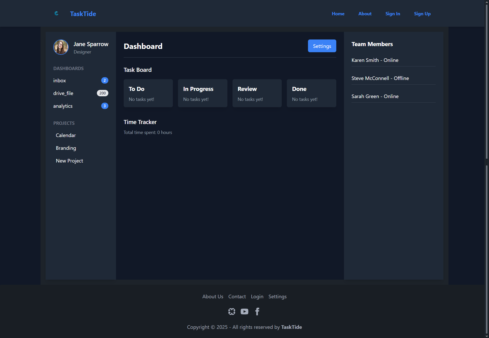

# TaskTide

TaskTide is a task management application that allows users to create, manage, and track projects, tasks, and team collaboration. It includes real-time features, a modern dashboard inspired by productivity tools, and secure user authentication.

# Preview

.
.
.


## Features
- User signup and login with password hashing and JWT authentication.
- Dashboard for managing projects, tasks, and team members.
- Real-time updates and notifications with Socket.IO.
- Time tracking for project tasks.
- Responsive design using React and Tailwind CSS.

## Technologies Used

### Frontend
- React
- Tailwind CSS
- Redux
- React Router
- React Hook Form

### Backend
- Node.js with Express
- PostgreSQL
- OAuth (for user authentication, if required)
- bcrypt (for password hashing)
- jsonwebtoken (for generating JWT tokens)

### Real-Time Features
- Socket.IO

### Deployment
- Compatible with Heroku, Vercel, or Netlify.

## Getting Started

### Prerequisites
- [Node.js](https://nodejs.org/) installed.
- [PostgreSQL](https://www.postgresql.org/) installed and running.
- A package manager like `npm` or `yarn`.

### Installation
1. Clone the repository:
   ```bash
   git clone https://github.com/yourusername/tasktide.git
   cd tasktide
   ```

2. Install dependencies:
   ```bash
   npm install
   ```

3. Set up the PostgreSQL database:
   - Create a new database called `tasktide_db`.
   - Run the following SQL to create the `users` table:
     ```sql
     CREATE TABLE users (
         id SERIAL PRIMARY KEY,
         email VARCHAR(255) UNIQUE NOT NULL,
         password_hash VARCHAR(255) NOT NULL,
         created_at TIMESTAMP DEFAULT CURRENT_TIMESTAMP
     );
     ```

4. Set up environment variables:
   Create a `.env` file in the root directory and configure the following:
   ```env
   DB_USER=your_postgres_username
   DB_PASSWORD=your_postgres_password
   DB_HOST=localhost
   DB_PORT=5432
   DB_NAME=tasktide_db
   JWT_SECRET=your_jwt_secret
   ```

### Running the Application
1. Start the backend server:
   ```bash
   npm start
   ```
   The server will run at `http://localhost:5000`.

2. Start the React frontend:
   ```bash
   cd client
   npm start
   ```
   The frontend will run at `http://localhost:3000`.

### Testing API Endpoints
Use a tool like [Postman](https://www.postman.com/) or cURL to test the API endpoints:

- **Signup:**
  ```bash
  POST http://localhost:5000/api/auth/signup
  {
    "email": "test@example.com",
    "password": "Test1234"
  }
  ```

- **Login:**
  ```bash
  POST http://localhost:5000/api/auth/login
  {
    "email": "test@example.com",
    "password": "Test1234"
  }
  ```

## Project Structure
```plaintext
.
├── client              # Frontend React app
├── routes              # API routes
├── models              # Database models (if applicable)
├── db.js               # PostgreSQL connection setup
├── server.js           # Main server file
├── .env                # Environment variables
├── README.md           # Project documentation
```

## Deployment
TaskTide can be deployed using platforms like Heroku, Vercel, or Netlify. For backend services, configure the `DATABASE_URL` environment variable provided by the platform.

## notes from the owner
- front-end could use more polish
- back-end has not implemented yet

## Future Enhancements
- Add real-time chat for team members.
- Implement advanced task filtering and search.
- Integrate with third-party services like Google Drive or Slack.

## License
This project is licensed under the MIT License. See the LICENSE file for details.

## Acknowledgments
- Inspired by modern productivity tools like Asana and Trello.
- Thanks to open-source contributors and the community for providing guidance and libraries.

